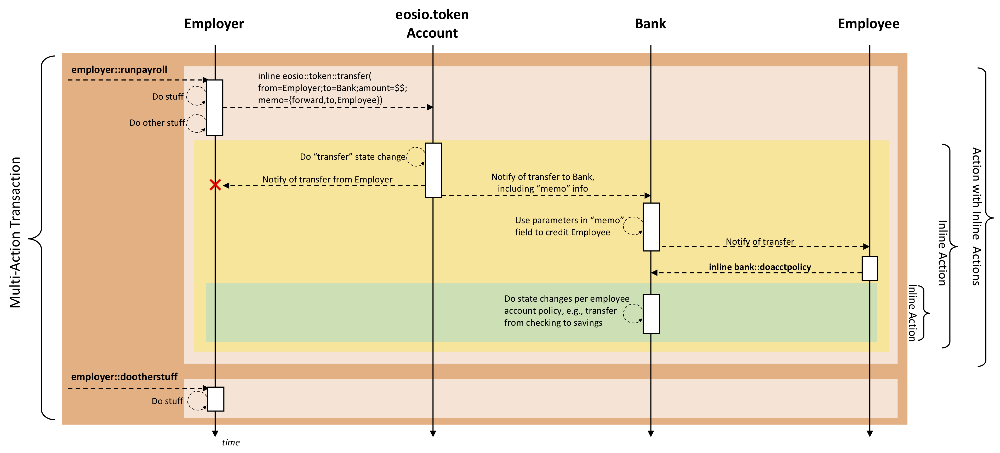
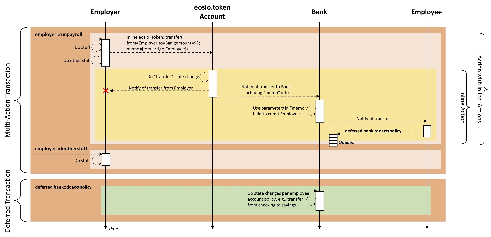

# EOSIO Smart Contract

<!-- MarkdownTOC autolink="true" bullets="-,*,+" -->

- [Introduction to EOSIO Smart Contracts](#introduction-to-eos-smart-contracts)
  * [Required Background Knowledge](#required-background-knowledge)
- [Basics of EOSIO Smart Contracts](#basics-of-eosio-smart-contracts)
  * [Overview](#overview)
  * [Action Handler and Action "Apply" Context](#action-handlers-and-apply-context)
  * [Communication Model and Execution Flow](#communication-model-and-execution-flow)
  * [Smart Contract Files](#smart-contract-files)
- [Debugging Smart Contracts](#debugging-smart-contracts)

<!-- /MarkdownTOC -->

# Introduction to EOSIO Smart Contracts
A real-world contract, simply stated, is an agreement governing outcomes for actions, given a set of inputs. A contract
can range from formal legal contracts (e.g., a financial transaction) to something as simple as the "rules" of a game.
Typical actions can be things such as fund transfers (in the case of a financial contract) or game moves (in the case of
a game contract).

An EOSIO Smart Contract is software registered on the blockchain and executed on EOSIO nodes, that implements the semantics
of a "contract" whose ledger of action requests are being stored on the blockchain. The Smart Contract defines the
interface (actions, parameters, data structures) and the code that implements the interface. The code is compiled into a
canonical bytecode format that nodes can retrieve and execute. The blockchain stores the transactions (e.g., legal
transfers, game moves) of the contract. _**Each Smart Contract must be accompanied by a Ricardian Contract that defines
the legally binding terms and conditions of the contract.**_

## Required Background Knowledge

### C / C++ Experience

EOSIO based blockchains execute user-generated applications and code using [WebAssembly](http://webassembly.org/) (WASM).
WASM is an emerging web standard with widespread support of Google, Microsoft, Apple, and others. The most mature
toolchain for building applications that compile to WASM is [clang/llvm](https://clang.llvm.org/) with their C/C++ compiler.
For best compatibility, it is recommended that you use the EOSIO toolchain.

Other toolchains in development by 3rd parties include: Rust, Python, and Solidity. While these other languages might
appear simpler, their performance will likely impact the scale of application you can build. We expect that C++ will be
the best language for developing high-performance and secure smart contracts, and plan to use C++ for the foreseeable future.

### Linux / Mac OS Experience

The EOSIO software supports the following environments:
- Amazon 2017.09 and higher
- Centos 7
- Fedora 25 and higher (Fedora 27 recommended)
- Mint 18
- Ubuntu 16.04 LTS (Ubuntu 16.10 recommended)
- Ubuntu 18.04 LTS
- MacOS Darwin 10.12 and higher (MacOS 10.13.x recommended)

### Command Line Knowledge

There are a variety of tools provided along with EOSIO that require you to have basic command line knowledge in order to
interact with them.

# Basics of EOSIO Smart Contracts

## Overview

An EOSIO Smart Contract consists of a set of action and type definitions.  Action definitions specify and implement the
behaviors of the contract.  The type definitions specify the required content and structures.  EOSIO actions operate
primarily in a message-based communication architecture.  A client invokes actions by sending (pushing) messages to
`nodeos`.  This can be done using the `cleos` command.  It can also be done using one of the EOSIO `send` methods (e.g.,
`eosio::action::send`). `nodeos` dispatches action requests to the WASM code that implements
a contract.  That code runs in its entirety, then processing continues to the next action.

### Action vs Transaction

An action represents a single operation, whereas a transaction is a collection of one or more actions. A contract and an
account communicate in the form of actions. Actions can be sent individually, or in combined form if they are intended to be executed as a whole. 

*Transaction with one action*.

```base
{
  "expiration": "2018-04-01T15:20:44",
  "region": 0,
  "ref_block_num": 42580,
  "ref_block_prefix": 3987474256,
  "net_usage_words": 21,
  "kcpu_usage": 1000,
  "delay_sec": 0,
  "context_free_actions": [],
  "actions": [{
      "account": "eosio.token",
      "name": "issue",
      "authorization": [{
          "actor": "eosio",
          "permission": "active"
        }
      ],
      "data": "00000000007015d640420f000000000004454f5300000000046d656d6f"
    }
  ],
  "signatures": [
    ""
  ],
  "context_free_data": []
}
```

*Transaction with multiple actions*, these actions must all succeed or the transaction will fail.
```base
{
  "expiration": "...",
  "region": 0,
  "ref_block_num": ...,
  "ref_block_prefix": ...,
  "net_usage_words": ..,
  "kcpu_usage": ..,
  "delay_sec": 0,
  "context_free_actions": [],
  "actions": [{
      "account": "...",
      "name": "...",
      "authorization": [{
          "actor": "...",
          "permission": "..."
        }
      ],
      "data": "..."
    }, {
      "account": "...",
      "name": "...",
      "authorization": [{
          "actor": "...",
          "permission": "..."
        }
      ],
      "data": "..."
    }
  ],
  "signatures": [
    ""
  ],
  "context_free_data": []
}
```

### Transaction Confirmation

On completion of the transaction, a transaction receipt is generated.
Receiving a transaction hash does not mean that the transaction has been confirmed, it only means that the node accepted
it without error, which also means that there is a high probability other producers will accept it.

By means of confirmation, you should see the transaction in the transaction history with the block number of which it
is included.

### Action Name Restrictions

Action types are actually **base32 encoded 64-bit integers**. This means they are limited to the characters
a-z, 1-5, and '.' for the first 12 characters. If there is a 13th character then it is restricted to the
first 16 characters ('.' and a-p).

<a name="action-handlers-and-apply-context"></a>
## Action Handlers and Action "Apply" Context

Smart contracts provide action handlers to do the work of requested actions. (More on this
[below](#`apply`-action-handler-and-the-`eosio_abi`-macro))
Each time an action runs, i.e., the action is "applied" by running the `apply` method in the contract implementation,
EOSIO creates a new action "apply" context within which the action runs. 
The diagram below illustrates key elements of the action "apply" context.


From a global view of an EOSIO blockchain, every node in the EOSIO network gets a copy of and runs every action in every
contract.  Some of the nodes are doing the actual work of the contract, while others are processing in order to prove
the validity of the transaction blocks.  It is, therefore, important that contracts be able to determine "who they are",
or basically, under which context are they running. Context identification information is provided in the action context,
as illustrated in the above diagram by `receiver, code, action`.  `receiver` is the account that is currently processing
the action. `code` is the account that authorized the contract. `action` is the ID of the currently running action.

As discussed above, actions operate within transactions; if a transaction fails, the results of all actions in
the transaction must be rolled back.  A key part of the action context is the Current Transaction Data.  This contains
a transaction header, an ordered vector of all of the original actions in the transaction, a vector of the context free
actions in the transaction, a prunable set of context free data (provided as a vector of blobs) defined by the code that
implements the contract, and a full index to the vector of blobs.

Before processing an action, EOSIO sets up a clean working memory for the action. This is where the working variables for
the action are held. An action's working memory is available only to that action, even for actions in the same transaction.
Variables that might have been set when another action executed
are not available within another action's context. The only way to pass state among actions is to persist it to and retrieve
it from the EOSIO database. See [Persistence API](Persistence-API) for details on how to use the EOSIO persistence services.

An action can have many side effects. Among these are:

- Change state persisted in the EOSIO persistent storage
- Notify the recipient of the current transaction
- Send inline action requests to a new receiver
- Generate new (deferred) transactions
- Cancel existing (in-flight) deferred transactions (i.e., cancel already-submitted deferred transaction requests)

## Communication Model and Execution Flow

EOSIO Smart Contracts can communicate with each other, e.g., to have another contract perform some operation pertinent
to the completion of the current transaction, or to trigger a future transaction outside of the scope of the current
transaction.

EOSIO supports two basic communication models, **inline** and **deferred**. An operation to perform within the current
transaction is an example of an inline action, while a triggered future transaction is an example of a deferred action.

Communication among contracts should be considered as occurring asynchronously. The asynchronous communication model
can result in spam, which the resource limiting algorithm will resolve.

### Inline Communication

Inline communication takes the form of requesting other actions that need to be executed as part of the calling action.
Inline actions operate with the same scopes and authorities of the original transaction, and are guaranteed to execute 
with the current transaction. These can effectively be thought of as nested transactions within the calling transaction.
If any part of the transaction fails, the inline actions will unwind with the rest of the transaction. Calling the
inline action generates no notification outside the scope of the transaction, regardless of success or failure.

### Deferred Communication

Deferred communication conceptually takes the form of action notifications sent to a peer transaction. Deferred actions
get scheduled to run, at best, at a later time, at the producer's discretion. There is no guarantee that a deferred action
will be executed.

As already mentioned, deferred communication will get scheduled later at the producer's discretion. From the perspective
of the _originating transaction_, i.e., the transaction that creates the deferred transaction, it can only determine
whether the create request was submitted successfully or whether it failed (if it fails, it will fail immediately).
Deferred transactions carry the authority of the contract that sends them. A
transaction can cancel a deferred transaction.

### Example Transaction Flow

The following diagram illustrates a multi-action transaction that has multiple levels of inline actions. Imagine a scenario
where an Employer runs its payroll, transferring payment into its Employees' accounts. The Employee accounts are managed
by a Bank. The Bank offers notification to its customers (Employees) so that the customer can take advantage of
Bank-offered services such as automatic transfer between checking and savings accounts.



In this example,
the original transaction contains two actions on an `employer` contract: `employer::runpayroll` and `employer::dootherstuff`.
The more interesting of the two actions is `runpayroll`.  Here is what it does. Indentation corresponds with the nesting
of the inline actions called.

- `runpayroll` does an inline `eosio::token::transfer` action from the Employer account to the Bank account. This example
chooses to embed in the "memo" field of the transfer the info needed by Bank to make sure the right Employee gets paid.
This is needed because the accounts involved in the `eosio::token::transfer` are Employer and Bank.
    - `eosio::token::transfer` action does the token transfer state changes,
    - then notifies the Employer (which does nothing),
    - then notifies the Bank.
        - The Bank has a contract that listens for the `eosio::token::transfer` notification. On receipt, the parameters
        in the "memo" of the original action are used for some application-specific work to transfer money into the
        Employee's account.
        - The Bank's action notifies the Employee account of the deposit.
            - The Employee has a contract that listens for the `eosio::token::transfer` notification. On receipt, the
            parameters are used to determine that the transfer is for itself, the Employee's contract sends an inline
            action `bank::doacctpolicy`.
                - `bank::doacctpolicy` performs some action for its customers based on customer-configured policy,
                e.g., to transfer funds between the Employee's checking and savings accounts it has with Bank.
- `dootherstuff` does some other action, illustrating that a transaction can have multiple actions.

The following diagram portrays the transaction trace tree equivalent of the example above.


### Example Deferred Transaction Flow

The above scenario could also be done using a deferred transaction.  The following diagram shows the deferred transaction
scenario.



Using a deferred transaction has some pretty significant differences. First, it can be seen that the Employee submits a
deferred action rather than an inline action. Second, instead of the action being delivered for processing, it is queued
for _**possible**_ future processing. _**This is a very important characteristic of deferred transactions to be aware of!**_
Third, the action, if/when invoked, occurs in a transaction independent of the original transaction that issued the
deferred request.  This last point highlights one motivation for using a deferred transaction. In the case of the example
used here, an Employee likely does not want their receipt of a paycheck from their Employer being dependent on whether
their Bank is able to successfully transfer funds from the Employee's checking to savings.  If the deferred transaction
never gets processed, the Employee can manually make the transfer, or the Bank can have an out-of-band process that
periodically processes such transactions.

## Smart Contract Files 

The [eosiocpp](Programs-&-Tools#eosiocpp) tool simplifies the work required
to bootstrap a new contract. `eosiocpp` will create the two smart contract files with the basic
skeleton to get you started.  These skeleton files are the same `.hpp` and `.cpp` files for the `hello` contract covered in the [hello world
contract tutorial](Tutorial-Hello-World-Contract)

```
$ eosiocpp -n ${contract}
```

The above will create a new empty project in the `./${project}` folder with two files:
```
${contract}.hpp ${contract}.cpp
```

### hpp

`${contract}.hpp` is the header file that contains the variables, constants, and functions referenced by the `.cpp` file.

### cpp

`${contract}.cpp` is the source file that contains the implementations of the functions of the contract. 

If you generate the `.cpp` file using the `eosiocpp` tool, the generated .cpp file would look similar to the following:

```
#include <eosiolib/eosio.hpp>
  
using namespace eosio;

class hello : public eosio::contract {
  public:
      using contract::contract;

      /// @abi action
      void hi( account_name user ) {
         print( "Hello, ", name{user} );
      }
};

EOSIO_ABI( hello, (hi) )
```

The generated skeleton file has one function, `hi`, that prints the name of the `user` data parameter passed in the command
request.

### `apply` action handler and the `EOSIO_ABI` macro

Every smart contract must provide an `apply` action handler. The `apply` action handler is a function that listens
to all incoming actions and performs the desired behavior. In order to respond to a particular action, code is required to
identify and respond to specific actions requests. `apply` uses the `receiver`, `code`, and `action` input parameters as filters
to map to the desired functions that implement particular actions. The `apply` function can filter on the `code` parameter
using something like the following:

```
if (code == N(${contract_name}) {
   // your handler to respond to particular action
}
```

Within a given `code`, one can respond to a particular action by filtering on the `action` parameter. This is normally
used in conjunction with the code filter.

```
if (action == N(${action_name}) {
    //your handler to respond to a particular action
}
```

### The `EOSIO_ABI` macro

To simplify the work for contract developers, the `EOSIO_ABI` macro encapsulates the lower level action mapping details
of the `apply` function, enabling developers to focus on their application implementation.

```
#define EOSIO_ABI( TYPE, MEMBERS ) \
extern "C" { \
   void apply( uint64_t receiver, uint64_t code, uint64_t action ) { \
      auto self = receiver; \
      if( code == self ) { \
         TYPE thiscontract( self ); \
         switch( action ) { \
            EOSIO_API( TYPE, MEMBERS ) \
         } \
         /* does not allow destructor of thiscontract to run: eosio_exit(0); */ \
      } \
   } \
} \
```

A developer needs only to specify the `code` and `action` names from the contract in the macro, and all of the underlying
C code mapping logic is generated by the macro. An example of use of the macro can be seen above,
i.e., `EOSIO_ABI( hello, (hi) )` where `hello` and `hi` are values from the contract.

### wast

Any program to be deployed to the EOSIO blockchain must be compiled into WASM format. This is the only format the blockchain accepts.

Once you have the `.cpp` file ready, you can compile it into a text version of WASM (.wast) using the `eosiocpp` tool.

```
$ eosiocpp -o ${contract}.wast ${contract}.cpp
```

### abi

The Application Binary Interface (ABI) is a JSON-based description on how to convert user actions between their JSON and
Binary representations. The ABI also describes how to convert the database state to/from JSON. Once you have described 
your contract via an ABI, developers and users will be able to interact with your contract seamlessly via JSON.

The ABI file can be generated from the `.hpp` files using the `eosiocpp` tool:

```
$ eosiocpp -g ${contract}.abi ${contract}.hpp
```

The following is an example of what the skeleton contract ABI looks like, created using `eosiocpp -g` as shown above:

```
{
  "____comment": "This file was generated by eosio-abigen. DO NOT EDIT - 2018-05-07T21:16:48",
  "types": [],
  "structs": [{
      "name": "hi",
      "base": "",
      "fields": [{
          "name": "user",
          "type": "account_name"
        }
      ]  
    } 
  ],
  "actions": [{
      "name": "hi",
      "type": "hi",
      "ricardian_contract": ""
    }
  ],
  "tables": [],
  "ricardian_clauses": []
}
```

You will notice that this ABI defines an action `hi` of type `hi`. This tells EOSIO that when `${account}->hi`
action is seen that the payload is of type `hi`. The type `hi` is defined in the `structs` array in the object,
with `name` set to `hi`.

The ABI has one input field, `user`, with type `account_name`. `account_name` is a built-in type used to represent
a base32 string as `uint64`. To see more about built-in types,
check [here](https://github.com/EOSIO/eos/blob/master/libraries/chain/contracts/abi_serializer.cpp).

# Debugging Smart Contracts

In order to debug your smart contract, you will need to setup a local `nodeos` node. This local node can be run as separate
private testnet or as an extension of networked testnet. This local node also needs to be run with the contracts-console option on, either `--contracts-console` via the command line or `contracts-console = true` via the config.ini

When creating your smart contract for the first time, it is recommended to test and debug your smart contract on a private
testnet first, since you have full control of the entire blockchain. This enables you to have unlimited amount of currency
needed, and you can just reset the state of the blockchain whenever you want. When it is ready for production, debugging
on a public testnet can be done by connecting your local `nodeos` to the public testnet. You can then see the log of the
testnet in your local `nodeos`.

The concept is the same, so for the following guide, debugging on the private single node testnet will be covered.


If you haven't set up your own local `nodeos`, please follow the [setup guide](Local-Environment). By default, your local
`nodeos` will run in a private testnet.

## Method

The main method used to debug smart contract is **Caveman Debugging**, where we utilize `print` statements to inspect the
value of variables and check the flow of the contract. Printing in smart contracts can be done through the _Print API_
([C](https://github.com/EOSIO/eos/blob/master/contracts/eoslib/print.h) and [C++](https://github.com/EOSIO/eos/blob/master/contracts/eoslib/print.hpp)).
The C++ API is a wrapper for the C API, so most often we will just use the C++ API.

## Print API
The _Print C API_ supports the following options for print various data types:
- prints - a null terminated char array (string)
- prints_l - any char array (string) with given size
- printi - 64-bit unsigned integer
- printi128 - 128-bit unsigned integer
- printd - double encoded as 64-bit unsigned integer
- printn - base32 string encoded as 64-bit unsigned integer
- printhex - hex given binary of data and its size 

The _Print C++ API_ wraps some of the _C API_ by overriding the `print()` function, thus encapsulating some of the
data type-specific details and reducing concern about which specific print function to use. The _Print C++ API_ supports:
- a null terminated char array (string)
- integer (128-bit unsigned, 64-bit unsigned, 32-bit unsigned, signed, unsigned)
- base32 string encoded as 64-bit unsigned integer
- struct that has print() method

There is also a compile-time `print_f` function that can be used for debugging. Instances of the `%` symbol in the format
string will be positionally filled in with the right type.  E.g.,
```
    auto count = 5;
    auto some_name = "this is the name";
    print_f("Count = % and some_name = %\n", count, some_name);
```

## Example

Here we write a new contract as example for debugging.  We'll start by generating a skeleton for contract `debug`.

```
$ eosiocpp -n debug
$ cd debug
```

### debug.cpp

Modify the generated `debug.cpp` file to look as follows.

```cpp
#include <eosiolib/eosio.hpp>
  
class debug : public eosio::contract {
  public:
      using contract::contract;

      // @abi action
      void debugfunc( account_name from, account_name to, uint64_t amount ) {
         auto header = "======== debugfunc ========";
         eosio::print( header, "\n" );
         eosio::print( "from = ", from, "  to = ", to, "  amount = ", amount, "\n" );
         eosio::print( "from = ", eosio::name{from}, "  to = ", eosio::name{to}, "  amount = ", amount, "\n" );
      }
};

EOSIO_ABI( debug, (debugfunc) )
```

### debug.wast

Generate the `debug.wast` file using the following:

```
$ eosiocpp -o debug.wast debug.cpp
```

### debug.abi

The `debug.abi` file can be generated using `eosiocpp -g debug.abi debug.cpp`:
```json
{
  "____comment": "This file was generated by eosio-abigen. DO NOT EDIT - 2018-05-08T19:11:54",
  "types": [],
  "structs": [{
      "name": "debugfunc",
      "base": "",
      "fields": [{
          "name": "from",
          "type": "account_name"
        },{
          "name": "to",
          "type": "account_name"
        },{
          "name": "amount",
          "type": "uint64"
        }
      ]
    }
  ],
  "actions": [{
      "name": "debugfunc",
      "type": "debugfunc",
      "ricardian_contract": ""
    }
  ],
  "tables": [],
  "ricardian_clauses": []
}
```

### Deploy and Apply an Action
We can now deploy and send an action request to it. This assumes that you have `debug` account created and have its key in your wallet.
```
$ cleos set contract debug debug.wast debug.abi
$ cleos push action debug debugfunc '["fred", "barney", 200 ]' -p debug
```

When you check your local `nodeos` node log, you will see the following lines after the above action is applied.
```
======== debugfunc ========
from = 6761187270264356864  to = 4156599770598604800  amount = 200
from = fred  to = barney  amount = 200
```
Using this technique, you can confirm that your actions are behaving as desired. You might see messages two or more times.
This is normal because each transaction is being applied during verification, block generation, and block application.

